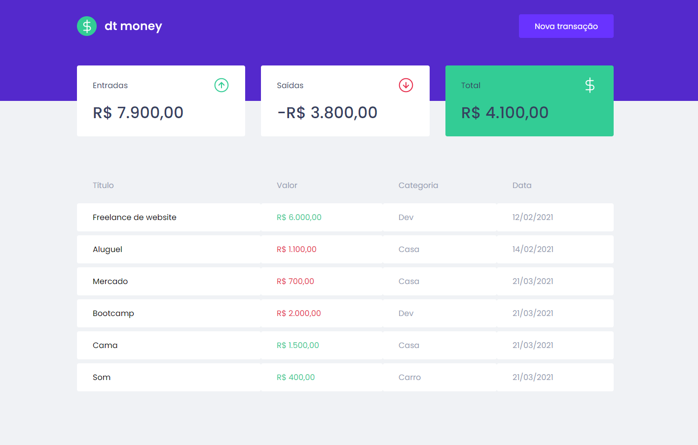

<h1 align="center">
  
</h1>

<h3 align="center">
  ReactJS Application for DT Money
</h3>

<p align="center">The best way to take care of your bills!</p>

<p align="center">
  

  <a href="https://www.linkedin.com/in/caioperess/" target="_blank" rel="noopener noreferrer">
    
  </a>

  

  <a href="https://github.com/caioperess/ignite-dtmoney/commits/master">
    
  </a>

  <a href="https://github.com/caioperess/ignite-dtmoney/issues">
    
  </a>

  
</p>

<p align="center">
  <a href="#%EF%B8%8F-about-the-project">About the project</a>&nbsp;&nbsp;&nbsp;|&nbsp;&nbsp;&nbsp;
  <a href="#-technologies">Technologies</a>&nbsp;&nbsp;&nbsp;|&nbsp;&nbsp;&nbsp;
  <a href="#-getting-started">Getting started</a>&nbsp;&nbsp;&nbsp;|&nbsp;&nbsp;&nbsp;
  <a href="#-how-to-contribute">How to contribute</a>&nbsp;&nbsp;&nbsp;|&nbsp;&nbsp;&nbsp;
  <a href="#-license">License</a>
</p>

<p align="center">
  
</p>

<p align="center">
  
</p>

## 💰 About the project

Dtmoney is a financial control application with the same idea as dev.finances, but with more advanced technologies and resources studied and used, open source libraries developed by the community. It was developed during the Chapter II classes of the Bootcamp Ignite ReactJS track by Rocketseat, and it is possible to register and delete transactions and see the incoming and outgoing balance.

## 🚀 Technologies

Technologies that I used to develop this mobile client

- [ReactJS](https://reactjs.org/)
- [TypeScript](https://www.typescriptlang.org/)
- [MirageJS](https://miragejs.com)
- [Styled Components](https://styled-components.com/)
- [Axios](https://github.com/axios/axios)

## 💻 Getting started
**Clone the project and access the folder**

```bash
$ git clone https://github.com/caioperess/ignite-dtmoney.git && cd ignite-dtmoney
```

**Follow the steps below**

```bash
# Install the dependencies
$ yarn

# Run application
$ yarn start
```

## 🤔 How to contribute

**Make a fork of this repository**

```bash
# Fork using GitHub official command line
# If you don't have the GitHub CLI, use the web site to do that.

$ gh repo fork caioperess/ignite-dtmoney
```

**Follow the steps below**

```bash
# Clone your fork
$ git clone your-fork-url && cd ignite-dtmoney

# Create a branch with your feature
$ git checkout -b my-feature

# Make the commit with your changes
$ git commit -m 'feat: My new feature'

# Send the code to your remote branch
$ git push origin my-feature
```

After your pull request is merged, you can delete your branch

## 📝 License

This project is licensed under the MIT License - see the [LICENSE](LICENSE.md) file for details.

---

Made with 💚 by Caio Peres 👋 [See my linkedin](https://www.linkedin.com/in/caioperess/)
